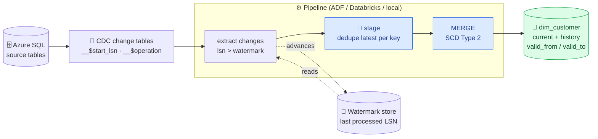

# 🔁 CDC → SCD Type 2 Warehouse

[](https://github.com/sourabhxmishra/cdc-scd2-warehouse/actions/workflows/ci.yml)
[](sql/merge_scd2.sql)
[](src/scd2.py)
[](infra/main.bicep)

> **Incremental done right — CDC to SCD Type 2 with an idempotent MERGE.**
>
> Azure SQL **CDC** → watermarked extract → a **MERGE** that keeps full **Slowly Changing
> Dimension Type 2** history. Re-run it a hundred times — same result, no duplicates.

The tricky bits — **watermarks, dedupe, SCD2 effective-dating, late/duplicate events, and
idempotency** — are implemented as a **pure-Python engine** ([`src/scd2.py`](src/scd2.py)) that is
**unit-tested locally and in CI** (no Spark or database needed to prove it works), alongside the
production **Delta `MERGE`** ([`sql/merge_scd2.sql`](sql/merge_scd2.sql)) and **Bicep** infra.

---

## 🏛️ Architecture



---

## ✨ The SCD2 merge (heart of the repo)

Close the current version, open a new one — and a **row hash** over the tracked columns makes
unchanged rows a **no-op**, so re-runs never duplicate history. In SQL ([`sql/merge_scd2.sql`](sql/merge_scd2.sql)):

```sql
MERGE INTO dim_customer t
USING staged s ON t.cust_key = s.cust_key AND t.is_current = true
WHEN MATCHED AND t.row_hash <> s.row_hash THEN
  UPDATE SET t.is_current = false, t.valid_to = s.change_ts   -- close the old version
WHEN NOT MATCHED THEN
  INSERT (...) VALUES (..., s.change_ts, null, true);          -- open a new version
```

The same semantics, as a tested Python function ([`src/scd2.py`](src/scd2.py)):

```python
apply_scd2(dim, changes, business_key="cust_key",
           tracked_cols=["name", "city", "tier"])   # -> new dim with full SCD2 history
```

---

## 🎯 What this demonstrates

| Skill | Where |
|-------|-------|
| **SCD Type 2** effective-dating (`valid_from` / `valid_to` / `is_current`) | [`src/scd2.py`](src/scd2.py) |
| **Idempotent** MERGE via a tracked-column hash | [`src/scd2.py`](src/scd2.py), [`sql/merge_scd2.sql`](sql/merge_scd2.sql) |
| **Incremental** extract with an **LSN watermark** | [`src/watermark.py`](src/watermark.py), [`src/cdc_reader.py`](src/cdc_reader.py) |
| **Dedupe** duplicate / late change events to latest-per-key | [`src/scd2.py`](src/scd2.py) (`dedupe_latest`) |
| Enabling **CDC** on the source | [`sql/enable_cdc.sql`](sql/enable_cdc.sql) |
| **IaC** — CDC-capable SQL (Standard) + ADLS Gen2 | [`infra/main.bicep`](infra/main.bicep) |
| **CI** — lint + unit tests + Bicep build | [`.github/workflows/ci.yml`](.github/workflows/ci.yml) |

---

## 🚀 Run it (no cloud needed)

```bash
pip install -r requirements.txt
python data/generate.py                      # synthetic CDC change feed -> data/_cdc/
python -m src.pipeline data/_cdc/day1.csv     # initial load
python -m src.pipeline data/_cdc/day2.csv     # updates + a new customer + a duplicate event
python -m src.pipeline data/_cdc/day2.csv     # re-run -> 0 changes (idempotent)
```

**Day 2** — Bob (C-002) moves Austin → Denver and upgrades to Gold, so his old row is closed and
a new current version opens; a new customer arrives; a duplicate event is collapsed:

```text
processed=4  watermark(LSN)=9  current_customers=6  total_versions=8

current dim_customer (SCD2, is_current=true):
  cust_key   name    city     tier     valid_from           valid_to
  C-002      Bob     Denver   Gold     2026-06-15T14:00:00  None      <- new version
  ...
```

**Re-running day2** processes **0** rows — the watermark is already at LSN 9 and the hashes match,
so nothing duplicates:

```text
processed=0  watermark(LSN)=9  current_customers=6  total_versions=8
```

## 🧪 Tests

```bash
ruff check src tests data
pytest -q      # insert · update (new version + close old) · dedupe · idempotency · end-to-end
```

---

## 📁 Repository structure

```text
cdc-scd2-warehouse/
├── infra/                       # 🏗️ Bicep IaC
│   ├── main.bicep               # SQL (Standard, CDC-capable) + ADLS Gen2
│   └── modules/{sql,storage}.bicep
├── src/
│   ├── scd2.py                  # ⭐ SCD Type 2 engine (hash-based, idempotent)
│   ├── watermark.py             # LSN high-watermark store
│   ├── cdc_reader.py            # read changes past the watermark
│   ├── config.py                # load config/tables.yaml
│   └── pipeline.py              # extract -> dedupe -> MERGE -> advance watermark
├── sql/
│   ├── enable_cdc.sql           # sys.sp_cdc_enable_db / _table
│   └── merge_scd2.sql           # production Delta MERGE (SCD2)
├── config/tables.yaml           # business keys + tracked columns
├── data/generate.py             # deterministic synthetic CDC feed
├── tests/                       # scd2 · watermark · end-to-end pipeline
└── .github/workflows/{ci,deploy}.yml
```

## 🏗️ Deploy the infra

```bash
az deployment group create -g <rg> -f infra/main.bicep -p sqlAdminPassword=<pwd>
# then run sql/enable_cdc.sql against the 'source' database
```

## 📚 More

- **[Case study: Do you really understand incremental?](docs/CASE-STUDY.md)**
- **[Walkthrough](docs/WALKTHROUGH.md)** — reproduce it end-to-end
- **[Portfolio](https://github.com/sourabhxmishra)** — the rest of the data-engineering projects
