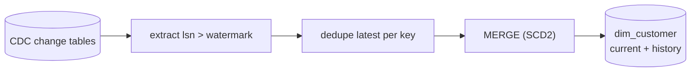

# Do you really understand incremental? CDC → SCD Type 2

> **TL;DR** — I built the classic incremental-load test end to end: capture changes with **CDC**,
> extract only rows **past a watermark**, and apply them with a **MERGE** that maintains full
> **Slowly Changing Dimension Type 2** history — all **idempotent**, so re-runs never duplicate or
> corrupt data. The tricky logic is a pure-Python engine that's unit-tested in CI, mirrored by the
> production Delta `MERGE`.

---

## 🎯 The problem

Full reloads don't scale and throw away history. "Incremental" *sounds* simple until you hit the
three questions every reviewer asks:

1. How do you read **only what changed**?
2. How do you keep **history** when a dimension attribute changes?
3. What happens when the job **runs twice** (or the source emits a change twice)?

---

## 🧭 The design

- **Capture** — enable **CDC** on the source ([`sql/enable_cdc.sql`](../sql/enable_cdc.sql)). SQL
  Server exposes inserts/updates/deletes with a log sequence number (`__$start_lsn`).
- **Extract** — pull only rows **past the stored watermark (LSN)** and advance the watermark
  *atomically after a successful load* ([`src/watermark.py`](../src/watermark.py)). This is what
  makes the pipeline incremental and safe to retry.
- **Stage** — **dedupe to the latest change per business key** ([`src/scd2.py`](../src/scd2.py),
  `dedupe_latest`). Real CDC feeds emit duplicates and out-of-order events; collapsing to one
  change per key before the merge keeps the load deterministic.
- **Load** — a single **MERGE** applies SCD2: close the current row (`valid_to`,
  `is_current = false`) and insert the new version. A **row hash** over the tracked columns makes
  an unchanged row a **no-op**.

## ⚖️ The tradeoffs

- **SCD2 vs SCD1** — history costs storage and adds query complexity (you must filter
  `is_current` or a point-in-time range). Worth it for auditability; I'd apply it only to
  dimensions that genuinely need history.
- **Watermark vs full-diff** — a watermark is cheap and fast but needs care with **late events**.
  I dedupe within the extract (latest-per-key) so duplicates and same-window reorderings resolve
  correctly; truly retroactive out-of-window updates are called out below.
- **Hash compare** — a tiny compute cost that eliminates churn from unchanged rows and, crucially,
  makes the whole load **idempotent**.

## 📈 The outcome

Proven by [`tests/`](../tests) and the runnable demo:

- **Only changed rows move.** Day 2 reads 4 changes; day-2 re-run reads **0**.
- **Full history.** When C-002 moves Austin → Denver, the Austin row is closed
  (`valid_to = 2026-06-15T14:00:00`) and a new Denver version opens — **8 total versions** across
  **6 current** customers.
- **Idempotent.** Re-running the same batch changes nothing: `processed=0`, same
  `total_versions=8`. Run it a hundred times — identical result.

## 🔭 What I'd add next

- **Hard deletes** as SCD2 tombstones (close the current row on a `D` operation).
- **Retroactive late arrivals** outside the dedupe window — insert the version in its correct
  temporal position and re-stitch `valid_from` / `valid_to` of the neighbours.
- A **reconciliation count** against the source to catch silent drift.

---

*Repo (IaC + CDC extract + SCD2 MERGE + tests): [`github.com/sourabhxmishra/cdc-scd2-warehouse`](https://github.com/sourabhxmishra/cdc-scd2-warehouse)*
